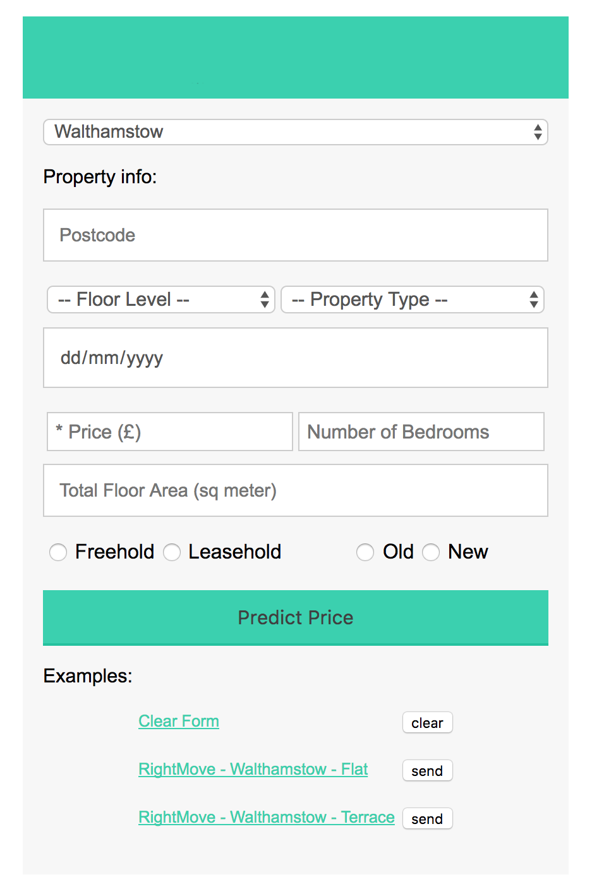
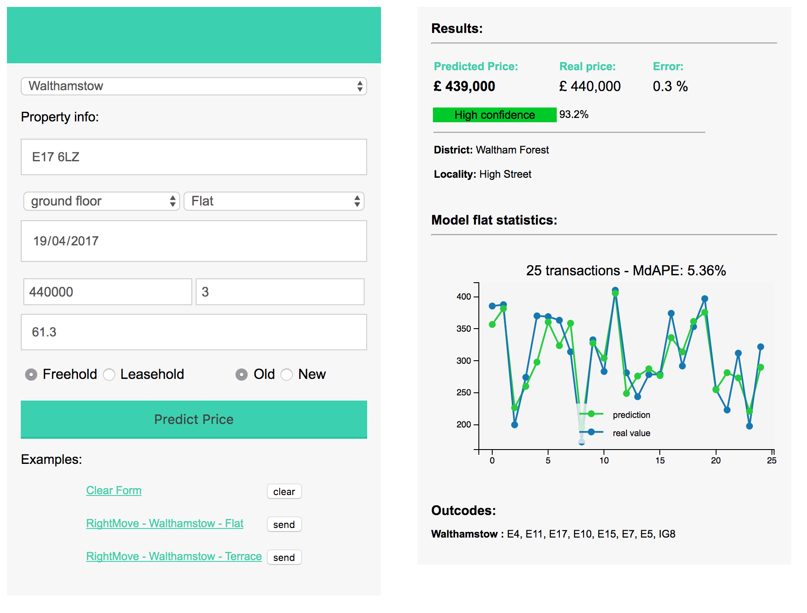
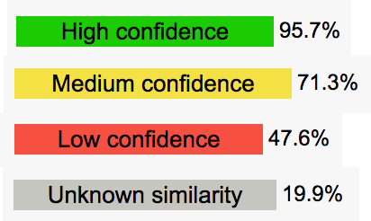

Properties price prediction - XGBoost regression
====

On this project I used XGboost regression to predict London properties sale price. I used a few tousand of past transactions entries (confidential database) to train a model that predicts transactinos over a region around Whalthamstow (London). 
Three diferent model were trained for the chossen region: **Flat**, **Terraces** and **Others**.

A smart data engineering were applied to de neat dataset in order to reach the desired performance. 
Cutting the outliers, past depreciation correction, geo coordinates conversion and features clustering were some of the tools applied to the raw dataset. 

XGoost regression were then used to train the three different models. 
Scikit-Optimized random search was essential to tuning the best hyperparameters.  

Finally, I made a REST API that uses the pre-trained model for Walthamstow (London) region to evaluate properties transactions prices (Fig.1). The medium absolute porcentage error (**MdAPE**) was **5.36%** for flats on test dataset. However, the performance for the real cases (data scraped from sale companies webpages) was not equally good due to the limited number of features available and the uncertainity of the provided data. 
A confidence score were created to classify the similarity of request transaction in comparison with the test dataset used.

### REST API - London price prediction

The web API is a simple application of the trained model where the user can request a prediction given a set of input data related to a property in UK. The required input data are: 

- **Postcode**: UK post code related to the property (XXX XXX)
- **Floor Level**: floor level of the requested property
- **Property Type**: type of the property: Flat, Terrace, Detached, Semi-Detached or Others
- **Date of Transaction**: date of the request transaction in a format dd/mm/yyyy
- ***Price**: price of sold transaction for comparison proposes **(not required)**
- **Number of bedrooms**: number of bedrooms of the property (see further discussion on "Further improvements")
- **Tenure**: wheter is a Freehold or Leasehold property
- **Age**: New or Old property classification

<table>
<tr style="border-collapse: collapse; border: none;">
<td style="border: none;">

</td>
<td style="border: none;">

</td>
</tr>
</table>

**Fig. 1** - Test REST API for the Walthamstow (London) model. (Left) Cover page and a (Right) request return results.

As Results the API presents the prediction price for the requested property, the absolute error (if of the sold price were informed) and the confidence score classification as described in the next section. Also, the API returns the disctric and locality information of the informed postcode. 

A statistics graph (price in thousand pounds) for the currently used model is also shown within the results panel. This graph presents random 25 transactions predictions and real prices from the test dataset selected from the original database (not used to training). I present here a Median absolute prediction error (MdAPE) as good as **5.4%** (**Flats** on Walthamstow), **3.1%** (for **Terraces**) and **2.8%** (for **Others**).

### Confidence (similarity) Score

In order to create a confidence classification, without rely on the properties price, I compared the requested valuation property features of the trained dataset with the request property features. The confidence score (Fig. 1) is based on three diferent features so far available: **total floor area**, **local price average** and the **number of rooms**. This features are wheighted following the model features importance. 

 
**Fig. 1** - Confidence score classification.

The transactions that have a confidence score bellow 25% are discarded in the test valuation and classified as `Unknown similarity`, above 25% score they are classified as following: 

**Low confidence** (25-50%), **Medium confidence** (50-75%) and **High confidence** (75-100%).

### Codes (notebooks)
 
* **data_engineering.ipynb** : prepare and encode the raw data.

* **parameters_tuning.ipynb** : use Scikit-optimize random search ot tuning the optimal parameters to XGBoost model.

* **train_model.ipynb** : train the XGBoost and evaluate the error over the test dataset. 

** due to confidentionality of this project the data source **is not** available.  

Hope you find useful information :)